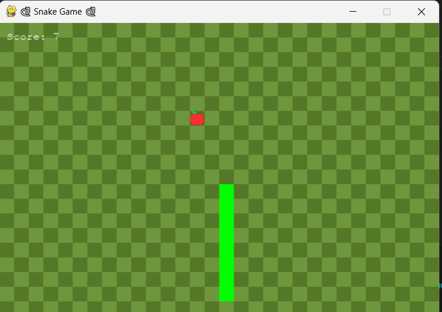

# SnakeGame

A retro-style Snake Game built with **Pygame** 🕽️, featuring:

* Emoji-based food 🍎
* Dark green grid background 🎨
* Game sounds and a start screen
* Pause and restart functionality
* Modular Python structure with helper files

## 🎮 Gameplay Screenshot



## 🧠 Features

* Grid-based snake movement with dark/light green grid
* Food aligned to grid with emoji-based visuals
* Sound effects on eating and game over
* Score tracking and high score memory
* Pause (`P`) and resume (`R`) support
* Clean start and game over screens
* Well-organized code with multiple files for logic, UI, and constants

## 🛠️ Tech Stack

* Python 3
* Pygame

## 🚀 Run the Game

```bash
pip install -r requirements.txt
python src/main.py
```

## 📂 File Structure

```
snake-game/
├── utilities/              # Images and sounds
│   ├── food.mp3
│   ├── gameover.wav
│   └── start_bg.jpg
├── source/                 # Game source code
│   ├── Game.py
│   ├── Display.py
│   ├── constants.py
│   ├── snake_logic.py
│   └── Start_screen.py
│
├── README.md
└──  requirements.txt
```

## 👩‍💻 Author

**Sai Varshita Morisetty**
